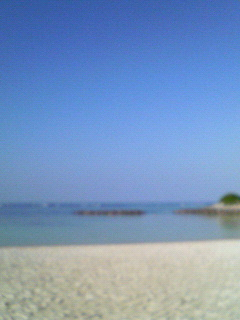

# グラデーション

このリポジトリはドロップダウンメニュー（`select`要素）を使用して、白色の二重線の下にある白色のエリア（`iframe`要素内）に各ディレクトリ内にある`index.html`ファイルの内容が表示されるようにしています。

［**選択してください**］を押下し、どれかを選択して表示させてみてください。

表示された内容は上から順に以下の通りです。

- プレビュー画面（`section`要素）
    - textarea要素内に記述されたコードの結果が表示されてます。
- HTMLコード（`textarea`要素）
    - HTMLコードが記述されています。
- CSSコード（`textarea`要素）
    - CSSコードが記述されています。
- リセットボタン（`input`要素）
    - textarea要素内に記述されているコードの変更を初期値（読み込まれた最初の状態）に戻すためのボタンです。
<br>

## 共通設定

それぞれのファイルに共通して記述されているコードがあります。

### HTML

グラデーションを表示させるためのボックスのHTMLコードです。

```html
<div class="box"></div>
```

アニメーションを再生または停止させるためのbutton要素です。

```html
<button>アニメーションを再生</button>
```

### CSS

プレビュー画面（section要素）内の背景を`#000`（黒色）に設定しています。

```css
section {
    background-color: #000;
}
```

プレビュー画面（section要素）内にあるテキスト（h2要素）の色は`#fff`（白色）に設定しています。

```css
h2 {
    color: #fff;
}
```

ボックス（div.box要素）は幅と高さを共に`200px`にして`margin: 0 auto;`を用いて画面中央に表示させ、`border-radius: 1em;`を指定してボックスの角を少し丸くしています。

```css
div.box {
    margin: 0 auto;
    width: 200px;
    height: 200px;
    border-radius: 1em;
}
```

アニメーションを再生または停止させるためのbutton要素への指定は以下の通りです。

```css
button {
    display: block;
    margin: 20px auto 0;
    padding: 0.2em 1em;
    font-family: inherit;
    font-size: 100%;
}
```

アットルールを使用して画面の幅が`699px`以下の場合、textarea要素内に記述されているコードのフォントサイズを`120%`から`100%`へと変更しています。 

```css
@media screen and (max-width: 699px) {
    textarea {
        font-size: 100%;
    }
}
```

これらのCSSの共通設定は、各ディレクトリ内にある`style.css`ファイルに記述しています。

### JavaScript

ページを読み込んだ時点でアニメーションが再生されてしまうのを防ぐために、JavaScirptでアニメーションを制御します。

```javascript
const box = document.querySelector("div.box"); // div.box要素を取得
const button = document.querySelector("button"); // button要素を取得

button.addEventListener("click", () => { // button要素をクリック
    if (button.innerHTML === "アニメーションを再生") { // button要素のinnerHTMLプロパティの値が"アニメーションを再生"だった場合
        box.classList.add("クラス名"); // div.box要素にクラス名を付与（"tile"、"scale"、"rotation"）
        button.innerHTML = "アニメーションを停止"; // button要素のinnerHTMLプロパティの値が"アニメーションを停止"に変更
    } else { // button要素をもう一度クリックしたら
        box.classList.remove("クラス名"); // div.box要素に付与したクラス名を削除（"tile"、"scale"、"rotation"）
        button.innerHTML = "アニメーションを再生"; // button要素のinnerHTMLプロパティの値が"アニメーションを再生"に戻る
    }
});
```
<br>

## 線形

### グラデーション

左上の端から`#110`（黄色かかった黒色）、`#cc4`（薄めの黄色）、`#444`（濃い灰色）、`#555`（やや濃い灰色）、`#111`（薄い黒色）の順番でグラデーションさせた線を表示していますが、斜めに`315deg`回転させているため、色の書き順は右下の端からになります。

```css
div.box {
    background: linear-gradient(315deg, #111 38%, #555 40%, #444 45%, #cc4 55%, #110 58%);
}
```

### 繰り返しグラデーション

左上の端から`#0c0`（薄い緑色）、`#222`（薄い黒色）でグラデーションさせた線を斜めに繰り返し表示していますが、斜めに`315deg`回転させているため、色の書き順は右下の端からになります。

```css
div.box {
    background: repeating-linear-gradient(315deg, #222 15%, #0c0 38%);
}
```

### アニメーション

左上の端から`#0ac`（明るい水色）と`#088`（暗い水色）を斜めに`315deg`回転させてグラデーションさせたdiv.box要素のサイズを幅と高さを共に`50px`でタイル状に並べています。

```css
div.box {
    background: linear-gradient(315deg, #088 20px, #0ac 50px);
    background-size: 50px 50px;
}
```

`animation`一括指定プロパティと`@keyframes`アットルールを用いて`50px`の幅を左方向へ`１秒`かけて移動させるアニメーションを繰り返すように設定をします。

```css
div.box.tile {
    animation: tile 1s infinite linear;
}

@keyframes tile {
    from { background-position-x: 0; }
    to { background-position-x: 50px; }
}
```
<br>

## 放射

### グラデーション

画面中央に`#000`（黒色）の球体と少し大きめの`#b79`（淡いピンク色）の球体を重ねて配置し、背景色は`#b79`（淡いピンク色）と`#000`（黒色）のグラデーションをさらに重ねて表示しています。

```css
div.box {
    background: radial-gradient(circle at center, #000 10%, #b79 12%, #000);
}
```

### 繰り返しグラデーション

画面左下から`#400`（茶色）`#00a`（濃い青色）で順番でグラデーションさせた円を繰り返し表示しています。

```css
div.box {
    background: repeating-radial-gradient(circle at bottom left, #400, #00a 20%);
}
```

### アニメーション

背景を`#000`（黒色）にして`#19c`（薄い青色）と`#3dc`（緑かかった水色）でグラデーションさせた球体を画面中央に配置します。

```css
div.box {
    position: relative;
    overflow: hidden;
}

div.box::before {
    content: "";
    position: absolute;
    inset: -25%;
    background: radial-gradient(circle at center, #19c, #3dc 14%, #000 15%);
}
```

`animation`一括指定プロパティと`@keyframes`アットルールを用いて`３秒`かけて小さくなったり大きくなったりするアニメーションを繰り返すように設定をします。

```css
div.box.scale::before {
    animation: scale 3s infinite linear;
}

@keyframes scale {
    0% { transform: scale(1); }
    50% { transform: scale(0.5); }
    100% { transform: scale(1); }
}
```
<br>

## 扇形

### グラデーション

`#070`（緑色）の矩形を画面の右上と左下、`#004`（濃い青色）の矩形を画面の右下と左上に配置したdiv.box要素のサイズを幅、高さともに`50px`でタイル状に並べ、市松模様として表示しています。

```css
div.box {
    background: conic-gradient(#070 0.25turn, #004 0.25turn 0.5turn, #070 0.5turn 0.75turn, #004 0.75turn);
    background-size: 50px 50px;
}
```

### 繰り返しグラデーション

`#089`（濃い水色）と`#025`（濃い青色）でグラデーションされた扇を繰り返し表示しています。

```css
div.box {
    background: repeating-conic-gradient(#089 30deg, #025 60deg);
}
```

### アニメーション

`#000`（黒色）を背景にして`#1a1`（明るい緑色）のレーダーを画面中央から扇形に配置します。

```css
div.box {
    position: relative;
    overflow: hidden;
}

div.box::before {
    content: "";
    position: absolute;
    inset: -25%;
    background: conic-gradient(#000 0deg, #1a1 50deg, #000 55deg, #000);
}
```

`animation`一括指定プロパティと`@keyframes`アットルールを用いてレーダーが`５秒`かけて周囲を照らすように回転させるアニメーションを繰り返すように設定をします。

```css
div.box.rotation::before {
    animation: rotation 5s infinite linear;
}

@keyframes rotation {
    from { transform: rotate(0deg); }
    to { transform: rotate(360deg); }
}
```
<br>

## 画像

### グラデーション

以下のビーチの写真にグラデーションを施しています。



上記にある共通設定を画像のサイズに合わせて幅を`240px`、高さを`320px`に変更しています。

```css
div.box {
    width: 240px;
    height: 320px;
}
```

`radial-gradient()`関数を使用して、画面中央を中心とした楕円（`transparent`（透明）と`#fff`（白色）のグラデーション）を表示しています。

```css
div.box {
    background: radial-gradient(ellipse at center, transparent 40%, #fff), url("images/beach.jpg");
}
```
<br>

※ 日本時間 2024/12/18 に変更しました。
<br><br>

[完成ページへ](https://yscyber.github.io/gradation/ "https://yscyber.github.io/gradation/")
