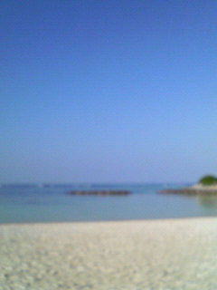

# グラデーション

## 線形グラデーション

### シングルグラデーション

左上の端から`黄色かかった黒色`、`薄めの黄色`、`濃い灰色`、`やや濃い灰色`、`薄い黒色`の順番でグラデーションさせた線を表示していますが、斜めに`315deg`回転させているため、色の書き順は右下の端からになります。

```css
div.linear-gradation {
    background: linear-gradient(315deg, #111 38%, #555 40%, #444 45%, #cc4 55%, #110 58%);              
}
```

### 繰り返しグラデーション

左上の端から`薄い緑色`、`薄い黒色`でグラデーションさせた線を斜めに繰り返し表示していますが、斜めに`315deg`回転させているため、色の書き順は右下の端からになります。

```css
div.linear-repeat {
    background: repeating-linear-gradient(315deg, #222 15%, #0c0 38%);
}
```

### アニメーション

左上の端から`明るい水色`と`暗い水色`を斜めに`315deg`回転させてグラデーションさせたdiv.box要素のサイズを幅と高さを共に`50px`でタイル状に並べています。

```css
div.linear-animation {
    background: linear-gradient(315deg, #088 20px, #0ac 50px);
    background-size: 50px 50px;
}
```

`animation`一括指定プロパティと`@keyframes`アットルールを用いて`50px`の幅を左方向へ`3秒`かけて移動させるアニメーションを繰り返すように設定をします。

```css
div.linear-animation.tile {
    animation: tile 3s infinite linear;
}

@keyframes tile {
    from { background-position-x: 0; }
    to { background-position-x: 50px; }
}
```
<br>

## 放射グラデーション

### シングルグラデーション

画面中央に`黒色`の球体と少し大きめの`淡いピンク色`の球体を重ねて配置し、背景色は`淡いピンク色`と`黒色`のグラデーションをさらに重ねて表示しています。

```css
div.radial-gradation {
    background: radial-gradient(circle at center, #000 10%, #b79 12%, #000);
}
```

### 繰り返しグラデーション

画面左下から`茶色`と`濃い青色`で順番でグラデーションさせた円を繰り返し表示しています。

```css
div.radial-repeat {
    background: repeating-radial-gradient(circle at bottom left, #400, #00a 20%);
}
```

### アニメーション

背景を`黒色`にして`薄い青色`と`緑かかった水色`でグラデーションさせた球体を画面中央に配置します。

```css
div.radial-animation {
    position: relative;
    overflow: hidden;
}

div.radial-animation::before {
    content: "";
    position: absolute;
    inset: -25%;
    background: radial-gradient(circle at center, #19c, #3dc 14%, #000 15%);
    
}
```

`animation`一括指定プロパティと`@keyframes`アットルールを用いて`7秒`かけて小さくなったり大きくなったりするアニメーションを繰り返すように設定をします。

```css
div.radial-animation.scale::before {
    animation: scale 7s infinite linear;
}

@keyframes scale {
    0% { transform: scale(1); }
    50% { transform: scale(0.5); }
    100% { transform: scale(1); }
}
```
<br>

## 扇形グラデーション

### シングルグラデーション

`緑色`の矩形を画面の右上と左下、`濃い青色`の矩形を画面の右下と左上に配置したdiv.box要素のサイズを幅、高さともに`50px`でタイル状に並べ、市松模様として表示しています。

```css
div.conic-gradation {
    background: conic-gradient(#070 0.25turn, #004 0.25turn 0.5turn, #070 0.5turn 0.75turn, #004 0.75turn);
    background-size: 50px 50px;
}
```

### 繰り返しグラデーション

`濃い水色`と`濃い青色`でグラデーションされた扇を繰り返し表示しています。

```css
div.conic-repeat {
    background: repeating-conic-gradient(#089 30deg, #025 60deg);
}
```

### アニメーション

背景を`黒色`にして`明るい緑色`のレーダーを画面中央から扇形に配置します。

```css
div.conic-animation {
    position: relative;
    overflow: hidden;
}

div.conic-animation::before {
    content: "";
    position: absolute;
    inset: -25%;
    background: conic-gradient(#000 0deg, #1a1 50deg, #000 55deg, #000);
}
```

`animation`一括指定プロパティと`@keyframes`アットルールを用いてレーダーが`10秒`かけて周囲を照らすように回転させるアニメーションを繰り返すように設定をします。

```css
div.box.rotation::before {
    animation: rotation 10s infinite linear;
}

@keyframes rotation {
    from { transform: rotate(0deg); }
    to { transform: rotate(360deg); }
}
```
<br>

## 画像

### グラデーション

以下のビーチの写真にグラデーションを施しています。



画像のサイズは幅を`240px`、高さを`320px`にしています。

```css
div.image {
    width: 240px;
    height: 320px;
}
```

`radial-gradient()`関数を使用して、画面中央を中心とした楕円（`透明`と`白色`のグラデーション）を表示しています。

```css
div.image {
    background: radial-gradient(ellipse at center, transparent 40%, #fff ), url("images/beach.jpg");
}
```
<br>

[完成ページへ](https://yscyber.github.io/gradation/ "https://yscyber.github.io/gradation/")
